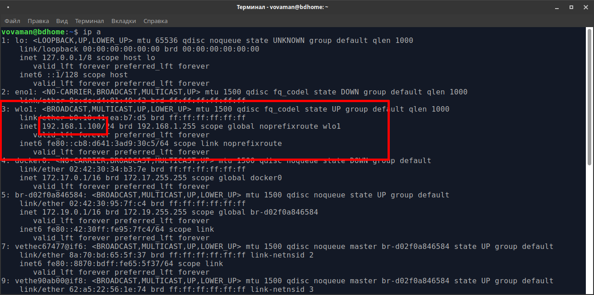
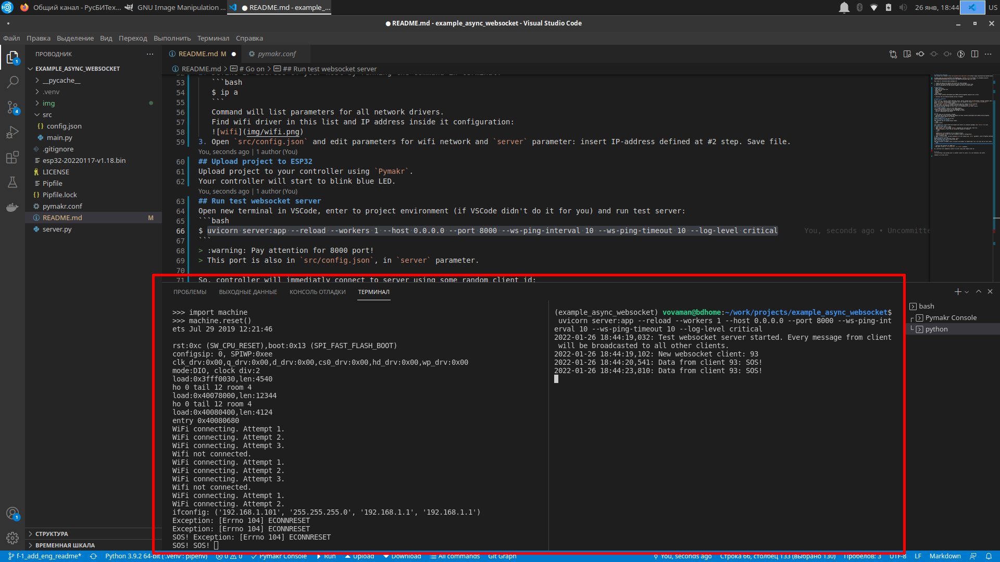
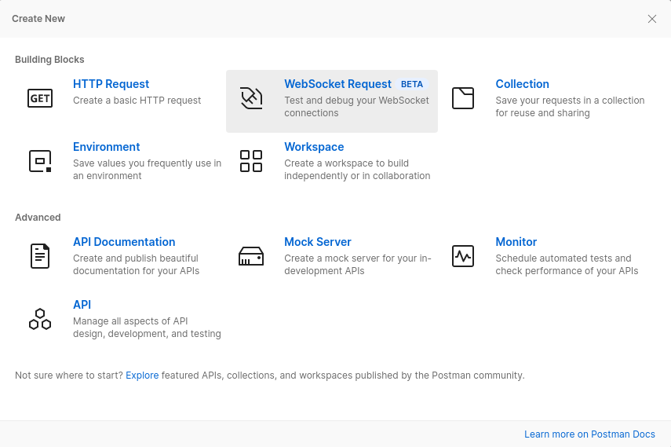
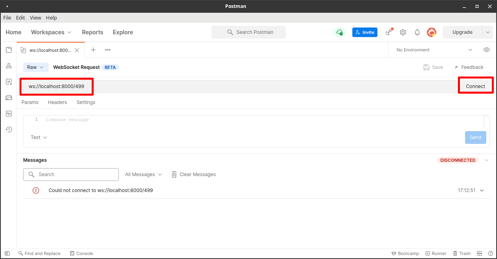
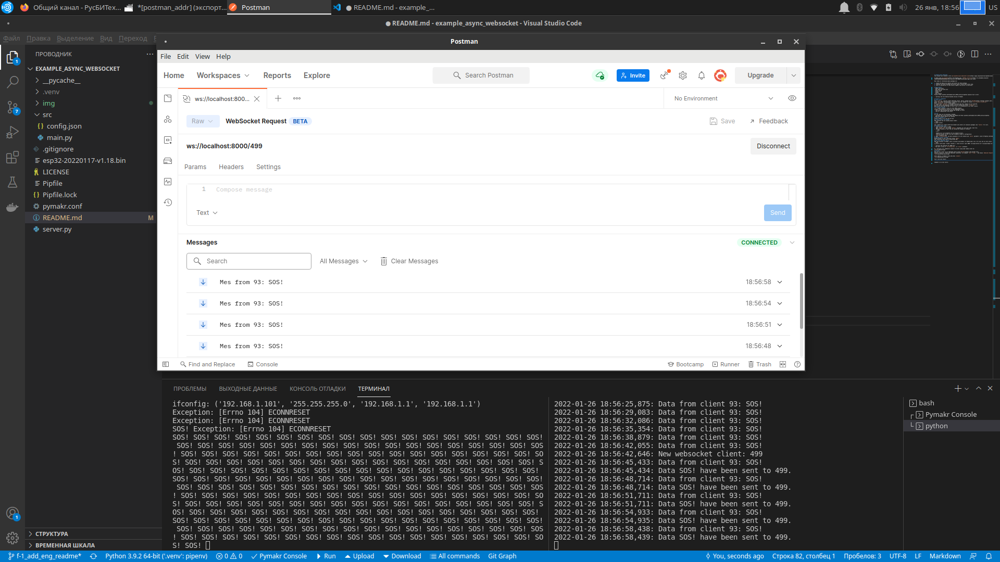
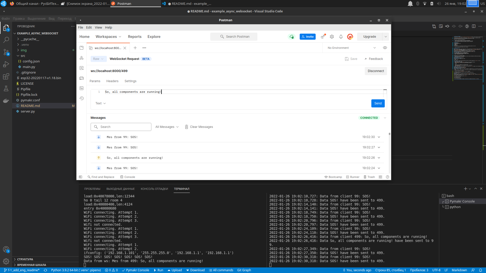

[Rus](README.rus.md)
# example_async_websocket
This project was created to test [micropython-async-websocket-client](https://pypi.org/project/micropython-async-websocket-client/) package.

It deals with [micropython](https://micropython.org), [ESP32S controller](https://ru.wikipedia.org/wiki/%D0%A4%D0%B0%D0%B9%D0%BB:ESP32_Espressif_ESP-WROOM-32_Dev_Board.jpg) and clones.

Main ideas of referenced above package are:

1. Create and keep alive channel with server for data exchange.
2. Problems with data exchange with server doesn't affect main cotrol loop.
3. There is possibility to send control signals from server to controller.

# Requirements
- ESP32 controller
- USB cable with data wire
- Ubuntu 22.04
- Python 3.10
- VSCode
- WiFi network
Project https://github.com/Vovaman/start_ESP32_with_micropython explains how to start.

> :warning: Use only deb-distributed version of VSCode!

# Project's components
## Test server
File `server.py` realizes simple websocket server. Server created with [FastAPI](https://fastapi.tiangolo.com/).
Server has simple functionality: it provides only one command for clients `ws://<server>/<client_id>`.
Where `client_id` is just random integer.
If client with `client_id` is already connected then this request will be rejected.
In other case a new websocket channel will be created with client `client_id`.
When client send some message to server then it is broadcasted to all other clients.
## ESP32 test project
`src` folder contains 2 files for test ESP32 project.
Project's functionality consists of two independent tasks:
- loop with LED blinking and sending SOS message to server
- loop for reading data from server.

# Create project environment
All the steps will be executed in VSCode.
> :warning: How to work with ESP32 and VSCode
> see https://github.com/Vovaman/start_ESP32_with_micropython.
> Read this project before you continue.

Open terminal and run inside project folder:
```bash
$ pipenv install
```
This command will create python-environment and install all necessary packages (see `Pipfile` for list).

# Upload micropython
Upload firmware with micropython to your controller or use
`esp32-20220618-v1.19.1.bin` file in this project.

# Start project

> :warning: Pay attention: the connection will be rejected by client
> every ten cycle to demonstrate re-handshaking.

## WS protocol
### Prepare config files
1. Define IP address of your host by running the command in terminal:
   ```bash
   $ ip a
   ```
   Command will list parameters for all network drivers.
   Find wifi driver in this list and IP address inside it configuration:
   
3. Open `src/config.json` and edit parameters for wifi network and `server` parameter: insert IP-address defined at previous step. Save the file.
### Upload project to ESP32
Upload project to your controller using `Pymakr`.
> :warning: We will install `micropython-async-websocket-client`
> at the next step, because `Pymakr` refresh file system on controller
> while installing project.
### Install micropython-async-websocket-client
Install into controller `micropython-async-websocket-client` as explained in https://pypi.org/project/micropython-async-websocket-client/.
Restart controller. It will start to blink blue LED.
### Run test websocket server
Open new terminal in VSCode, enter to project environment (if VSCode didn't do it for you) and run test server:
```bash
$ uvicorn server:app --reload --workers 1 --host 0.0.0.0 --port 8000 --ws-ping-interval 10 --ws-ping-timeout 10 --log-level info
```
> :warning: Pay attention for 8000 port!
> This port is also in `src/config.json`, in `server` parameter.

So, controller will immediatly connect to server using some random client id:


## WSS protocol
> :warning: There is no certificates validation now.
> So, this is why security is partial.
> Waiting for new micropython's release.
### Prepare config files
1. Define IP address of your host by running the command in terminal:
   ```bash
   $ ip a
   ```
   Command will list parameters for all network drivers.
   Find wifi driver in this list and IP address inside it configuration:
   
3. Open `src/config.json` and edit parameters for wifi network and `server` parameter: insert IP-address defined at previous step.
`server` parameter has to be like `wss://<server_ip>:8443/`.
Check for: `wss`, port number and slash at the end.
Save the file.
### Upload project to ESP32
Upload project to your controller using `Pymakr`.
> :warning: We will install `micropython-async-websocket-client`
> at the next step, because `Pymakr` refresh file system on controller
> while installing project.
### Install micropython-async-websocket-client
Install into controller `micropython-async-websocket-client` as explained in https://pypi.org/project/micropython-async-websocket-client/.
Restart controller. It will start to blink blue LED.
### Generate certificates
Run `gen_crt.sh`. It will create `tls` folder with certificates.
We need just two files: `server.key` and `server.crt`.
### Run test websocket server
Open new terminal in VSCode, enter to project environment (if VSCode didn't do it for you) and run test server:
```bash
$ uvicorn server:app --reload --workers 1 --host 0.0.0.0 --port 8443 --ws-ping-interval 10 --ws-ping-timeout 10 --log-level info --ssl-keyfile=./tls/server.key --ssl-certfile=./tls/server.crt
```
> :warning: Pay attention for 8443 port!
> This port is also in `src/config.json`, in `server` parameter.

So, controller will immediatly connect to server using some random client id:


# Postman
Add one more client to our websocket server using [Postman](https://www.postman.com/).
Install it and run. Create new websocket connection: run command `File --> New...` and choose `WebSocket Request`.

> :warning: Don't forget to set correct protocol: `ws` or `wss`.



Enter address in address field and press `Connect`:


You'll see such result:


So, let's send some message from Postman: write some text in message area and press `Send` button:


# Parameters
## src/config
```
{
    "wifi": {
        "SSID": "SSID",                      # network name
        "password": "***********",           # network password
        "attempts": 3,                       # how many times during one cycle we will try to connect to wifi
        "delay_in_msec": 200                 # delay after wifi.connect() command
    },
    "server": "ws://192.168.1.100:8000/",    # uri for test server
    "socket_delay_ms": 5                     # delay for read/write operations on socket. if you have slow wifi network, try to increase this delay
}
```
## uvicorn parameters for ping/pong
Pimg/pong is exchange of special messages between server and client to keep alive data channel.
Parameters for pimg/pong are initiated in command line for test server starting: `--ws-ping-interval 10 --ws-ping-timeout 10`.
If you will decrease this parameters, delay for socket disconnection will be smaller, but pimg/pong signal will be sent more quickly and
workload of ESP32 can extremely increase.
> :warning: Keep in mind: due to uvicorn parameters `--ws-ping-interval 10 --ws-ping-timeout 10`
> websocket channel will be closed after 20 seconds approximately after
> physical disconnection.

In any case, you can configure your work environment to adopt it for your controller model and wifi parameters.

# Conclusion
All our components are running. ESP32 do his job and stand connected to server, server recieve messages and broadcast them to all clients.
1. You may make some tests:
   - poweroff ESP32,
   - stop server,
   - send many messages from Postman quickly,
   - change src/config parameters to increase or decrease delays,
   - change uvicorn parameters `--ws-ping-interval 10 --ws-ping-timeout 10`
