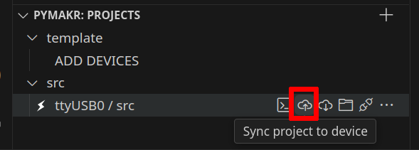
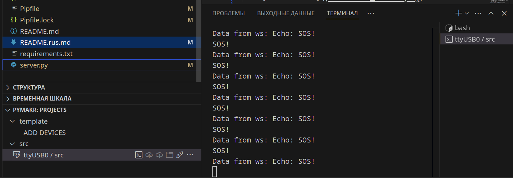
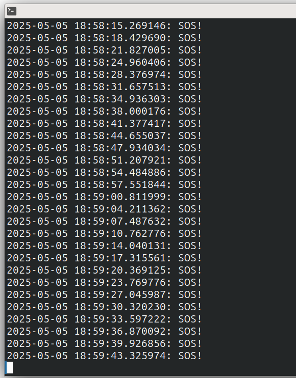
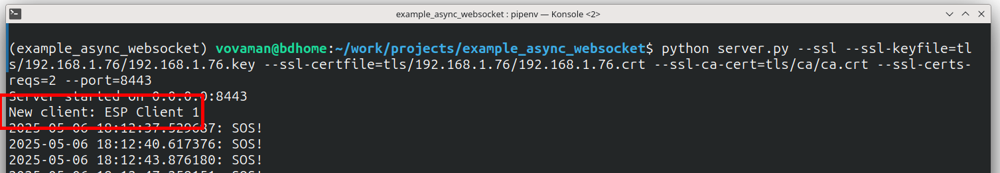

[Rus](README.rus.md)
# example_async_websocket
This project is designed to test the functionality of the [micropython-async-websocket-client](https://pypi.org/project/micropython-async-websocket-client/) package.

The project demonstrates the operation of an [ESP32S controller](https://ru.wikipedia.org/wiki/%D0%A4%D0%B0%D0%B9%D0%BB:ESP32_Espressif_ESP-WROOM-32_Dev_Board.jpg) and its clones
running [micropython](https://micropython.org).

Key objectives of the micropython-async-websocket-client package:

1. Establish and maintain a stable WebSocket connection with a server.
2. Ensure that connection failures do not disrupt the controller’s main workflow.
3. Enable bidirectional communication—sending data to the server and receiving control signals from it.

# Requirements
- ESP32 controller
- USB cable with data wire
- Ubuntu 24.04
- Python 3.10
- VSCode + PyMakr plugin

> [!CAUTION]
> 1. Use only the deb installation of VSCode!
>    The snap version does not support the PyMakr plugin!
> 2. The project https://github.com/Vovaman/start_ESP32_with_micropython
>    explains how to work with ESP32 in VSCode.
>    This includes PyMakr setup, file transfer to the controller, project synchronization, etc.
> 3. All further steps assume that pipenv and pyenv are installed as described in the above project.
> 4. All commands must be executed in the project’s root directory within the pipenv virtual environment.

- WiFi network

> [!CAUTION]
> This guide assumes the ESP32 operates in a local Wi-Fi network.
> Examples with TLS use self-signed certificates.

# Running Examples
Before running any examples:

- Obtain the Wi-Fi network name (<wifi network name>)
  and password (<wifi network pwd>) used by both the computer and the controller.
- Determine the computer’s IP address (<host IP>) in the Wi-Fi network.
- Synchronize the project with the controller:

  
- [install] the (https://github.com/Vovaman/micropython_async_websocket_client?tab=readme-ov-file#installation) ``async_websocket_client`` package.

If the connection between the server and controller is successful, the controller’s terminal will display:



...and the server’s console output will show:



## WS. No Encryption
The simplest case: unencrypted communication.

1. ``src/config.json``:
   ```json
   {
      "wifi": {
         "SSID": "<wifi network name>",
         "password": "<wifi network pwd>",
         "attempts": 3,
         "delay_in_msec": 200
      },
      "server": "ws://<host IP>:8000/",
      "socket_delay_ms": 5
   }
   ```
2. Update project on the controller:
   ```bash
   $ mpremote fs cp src/* :/
   ```
3. Reboot the controller.
4. Start the server:
   ```bash
   $ python server.py
   ```

## WSS.
### No Certificate Verification (Client or Server)

> [!CAUTION]
> TLS encrypts the channel even without certificates, but this is still insecure!

1. src/config.json:
   ```json
   {
      "wifi": {
         "SSID": "<wifi network name>",
         "password": "<wifi network pwd>",
         "attempts": 3,
         "delay_in_msec": 200
      },
      "server": "wss://<host IP>:8443/",
      "ssl": {
         "cert_reqs": 0
      },
      "socket_delay_ms": 5
   }
   ```
2. Even though certificate checks are disabled,
   the server must still use a certificate and key.

   Generate certificates:
   ```bash
   $ ./gen_crt.sh --srv=<host IP>
   ```

> [!NOTE]
> The gen_crt.sh script will prompt for a key password. Use the same password throughout.

The script copies required files to the project directory. Since the controller does not need certificates here, delete unnecessary files:
```bash
$ rm src/*.crt src/*.key src/ca.der
```
3. Update the project on the controller:
   ```bash
   $ mpremote fs cp src/* :/
   ```
4. Reboot the controller.
5. Start the server:
   ```bash
   $ python server.py --ssl --ssl-keyfile=tls/<host IP>/<host IP>.key --ssl-certfile=tls/<host IP>/<host IP>.crt --port=8443
   ```

> [!CAUTION]
> The server does not require a CA certificate in this mode.

### Server Certificate Verified by Controller, No Client Certificate Required
> [!CAUTION]
> Higher security: the controller verifies the server’s certificate,
> but the server allows any client.
>
> Still insecure.

1. ``src/config.json``:
   ```json
   {
      "wifi": {
         "SSID": "<wifi network name>",
         "password": "<wifi network pwd>",
         "attempts": 3,
         "delay_in_msec": 200
      },
      "server": "wss://<host IP>:8443/",
      "ssl": {
         "cert_reqs": 2,
         "ca": "ca.der"
      },
      "socket_delay_ms": 5
   }
   ```

2. Generate certificates:
   ```bash
   $ ./gen_crt.sh --srv=<host IP>
   ```

   Remove unnecessary files:
   ```bash
   $ rm src/*.crt src/*.key
   ```
3. The controller lacks a real-time clock (RTC) and defaults to January 1, 2000.
   If the system time is incorrect, certificate validation will fail with
   ``The certificate validity starts in the future``.

   Set the controller’s time via its console:

   ```python
   >>> from machine import RTC
   >>> rtc = RTC()
   >>> rtc.datetime((2025,5,7,1,13,0,0,0)) # replace with current time
   ```
4. Update the project on the controller:
   ```bash
   $ mpremote fs cp src/* :/
   ```
5. Reboot the controller.
> [!CAUTION]
> Time may reset after reboot.
> If this occurs frequently,
> add time-setting commands to the project code.
6. Start the server:
   ```bash
   $ python server.py --ssl --ssl-keyfile=tls/<host IP>/<host IP>.key --ssl-certfile=tls/<host IP>/<host IP>.crt --port=8443
   ```
### Certificates is optional
This mode is realized too, but we will not check it.

### Mutual Certificate Verification (Server and Controller)
Most secure mode: enables client authentication via certificates.

1. Generate certificates with a client name:
   ```bash
   $ ./gen_crt.sh --srv=<host IP> --cn="ESP Client 1"
   ```
2. ``src/config.json``:
   ```json
   {
      "wifi": {
         "SSID": "<wifi network name>",
         "password": "<wifi network pwd>",
         "attempts": 3,
         "delay_in_msec": 200
      },
      "server": "wss://<host IP>:8443/",
      "ssl": {
        "key": "ESP Client 1.key",
        "cert": "ESP Client 1.crt",
        "ca": "ca.der",
        "cert_reqs": 2
    },
      "socket_delay_ms": 5
   }
   ```
3. Set the controller’s time (as described earlier).
4. Update the project on the controller.
5. Reboot the controller.
6. Start the server:
   ```bash
   $ python server.py --ssl --ssl-keyfile=tls/<host IP>/<host IP>.key --ssl-certfile=tls/<host IP>/<host IP>.crt --ssl-ca-cert=tls/ca/ca.crt --ssl-certs-reqs=2 --port=8443
   ```

The server extracts the client’s name from the certificate:



This allows certificate-based client authorization on the server.

# Test project componenets
## Test server
The WebSocket server is implemented in ``server.py``.
It accepts connections, echoes received messages.
## Проект для ESP32
The ``src`` folder contains files for the ESP32 project. Key functionalities:
- Main loop: Blinks the onboard blue LED (if available) and sends SOS! to the server.
- Data loop: Receives server messages.

> [!NOTE]
> Tested with [firmware v1.25.0](https://micropython.org/resources/firmware/ESP32_GENERIC-20250415-v1.25.0.bin).

# Configuration parameters
## src/config
```
{
   "wifi": {
      "SSID": "SSID",                      # network name
      "password": "***********",           # network password
      "attempts": 3,                       # connection attempts per cycle
      "delay_in_msec": 200                 # post-connection delay (ms)
   },
   "server": "ws://192.168.1.100:8000/",    # server address
   "socket_delay_ms": 5                     # Read/write delay (increase for slow networks)
   "ssl": {
      "ca": "<ca cert in DER-format file name>", # CA certificate (DER format)
      "key": "<client key>", # client private key
      "cert": "<client cet>", # client certificate
      "cert_reqs": 2 # certificate check mode: 0 - CERT_NONE, 1 - CERT_OPTIONAL, 2 - CERT_REQUIRED
   }
}
```

# Conclusion
All components function correctly.
The ESP32 maintains communication with the server, and the server echoes messages to clients.

Test scenarios:
- Power cycle the controller.
- Stop/restart the server.
- Send rapid bursts of messages.
- Adjust ``socket_delay_ms`` in ``src/config.json``.
- Experiment with TLS settings.
- ...