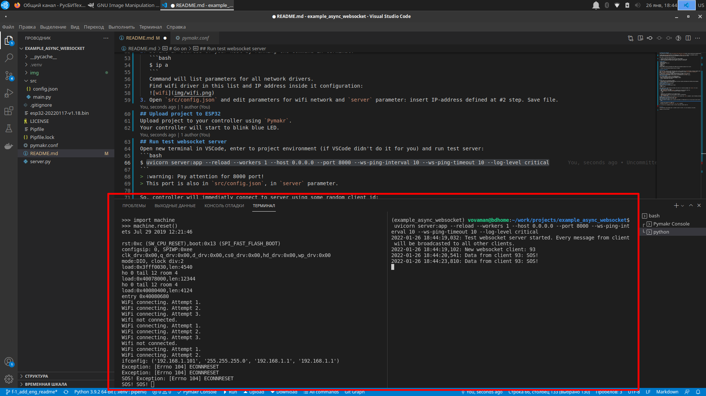
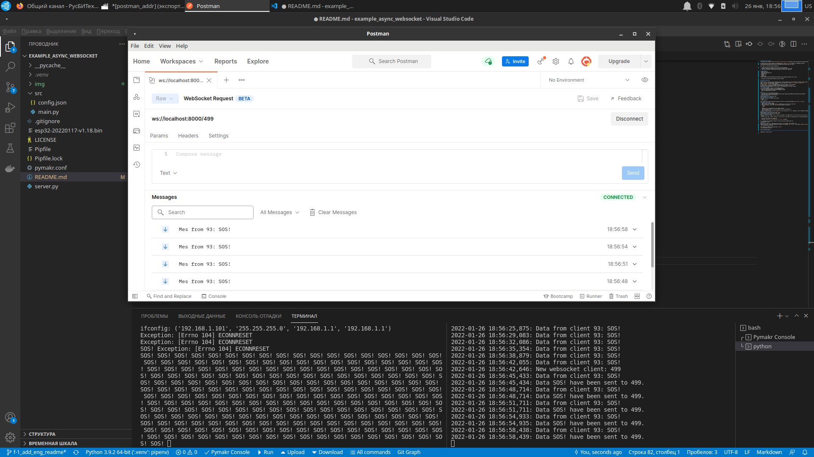
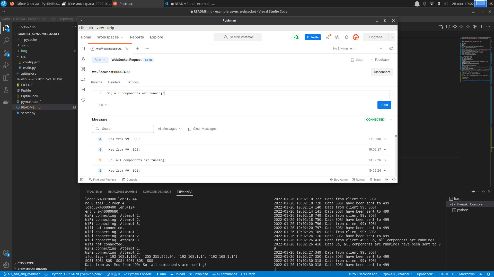

[Eng](README.md)
# example_async_websocket
Этот проект создан для тестирования работы пакета [micropython-async-websocket-client](https://pypi.org/project/micropython-async-websocket-client/).
В проекте рассматривается работа контроллера [ESP32S controller](https://ru.wikipedia.org/wiki/%D0%A4%D0%B0%D0%B9%D0%BB:ESP32_Espressif_ESP-WROOM-32_Dev_Board.jpg) и клонов под управлением [micropython](https://micropython.org).

Задачи, решаемые пакетом `micropython-async-websocket-client`:
1. Создать и поддерживать в рабочем режиме websocket-канал для связи с сервером.
2. Разрыв связи с сервером не должен влиять на основной рабочий цикл контроллера.
3. Данные не только посылаются на сервер, но появляется также возможность принимать управляющие сигналы с сервера.

# Требования
- ESP32 контроллер
- USB кабель с проводом для передачи данных
- Ubuntu 22.04
- Python 3.10
- VSCode
- сеть WiFi
Проект https://github.com/Vovaman/start_ESP32_with_micropython объясняет, как начать работу с ESP32, micropython'ом и VSCode.

> :warning: Используйте только  deb-установку VSCode! В версии для `snap` не работает расширение `Pymakr`!

# Компоненты тестового проекта
## Тестовый сервер
Тестовый websocket-сервер реализован в файле `server.py`. Сервер создан с помощью фреймворка [FastAPI](https://fastapi.tiangolo.com/) и
имеет простую функциональность. Сервер поддерживает только одну команду для клиентов: `ws(s)://<server>/<client_id>`, где
`client_id` - идентификатор клиента, случайное целое число.
Если клиент с `client_id` уже подсоединился, то новый запрос на коннект будет отвергнут.
В противном случае будет создан новый websocket-канал с клиентом `client_id`.
Когда клиент посылает сообщение серверу, то сервер рассылает это сообщение всем остальным клиентам.
## Проект для ESP32
Папка `src` содержит 2 файла для тестового ESP32 проекта.
Функциональность проекта состоит из двух задач:
- основной рабочий цикл контроллера моргает голубым диодом и посылает на сервер сообщение `SOS`;
- цикл чтения данных получает данные с сервера.

# Первоначальные шаги
Все описываемые шаги будут выполняться внутри VSCode.
> :warning: Как работать с контроллером в VSCode см. https://github.com/Vovaman/start_ESP32_with_micropython.
> Прочитайте описание в этом проекте перед тем, как продолжать.
## Создание окружения проекта
Откройте терминал (в VSCode или обычный) и внутри папки с исходниками этого проекта выполните команду:
```bash
$ pipenv install
```
Эта команда создаст python-окружение для проекта и установит все необходимые пакеты (см. их список в файле `Pipfile`).
## Прошивка контроллера
Прошейте контроллер файлом с micropython'ом. Для чего либо скачайте прошивку с сайта http://micropython.org, либо возьмите длф этого файл `esp32-20220117-v1.18.bin` в этом проекте.
## Установка пакета micropython-async-websocket-client
Установите на контроллер пакет `micropython-async-websocket-client`, как описано в https://pypi.org/project/micropython-async-websocket-client/.
## Исправление файлов конфигурации
1. Проверьте имя порта, к которому подключен ваш ESP32.
   Откройте файл `pymakr.conf` и исправьте параметр `address`, вписав туда корректное имя порта. Сохраните файл.
2. Определите IP адрес вашего компьютера в wifi-сети, для чего в терминале выполните команду:
   ```bash
   $ ip a
   ```
   Команда выведет список всех сетевых драйверов с их параметрами.
   Найдите в этом списке wifi драйвер и IP адрес в его конфигурации:
   
3. Откройте файл `src/config.json` и исправьте параметры wifi-сети и параметр `server`, в который впишите определённый на предыдущем шаге IP адрес. Сохраните файл.
## Загрузка проекта в ESP32
С помощью `Pymakr` загрузите проект на ваш контроллер.
Контроллер начнёт моргать голубым диодом.
## Запуск тестового websocket сервера
Откройте новый терминал в VSCode, войдите в окружение проекта, если VSCode не сделал это автоматически и запустите сервер:
```bash
$ uvicorn server:app --reload --workers 1 --host 0.0.0.0 --port 80 --ws-ping-interval 10 --ws-ping-timeout 10 --log-level critical
```
> :warning: Обратите внимание, что сервер будет работать на 8000 порту!
> Этот порт вписан в файле `src/config.json`, в параметр `server`.

Итак, после старта сервера контроллер немедленно к нему соединится, используя случайное число в качестве номера клиента:

## Postman
Добавим подключение ещё одного клиента к серверу, используя [Postman](https://www.postman.com/).
Установим его и запустим. Создадим новое websocket подключение используя команду `File --> New...`
и выбрав `WebSocket Request`:


Введем адрес и нажмём кнопку `Connect`:


Вы увидите такой результат:


Теперь давайте пошлем какое-нибудь сообщение из Postman серверу. Для этого в области ввода текста наберем какую-нибудь строку и нажмём кнопку `Send`:


# Заключение
Все компоненты работают. ESP32 выполняет свою работу и поддерживает канал связи с сервером, сервер принимает сообщения и рассылает их всем клиентам.
1. Попробуйте потестировать работу компонентов:
   - включайте/выключайте контроллер,
   - останавливайте сервер,
   - быстро посылайте много сообщений из Postman'а,
   - меняйте параметры задержек в файле конфигурации `src/config.json,
   - меняйте параметры uvicorn `--ws-ping-interval 10 --ws-ping-timeout 10`
# Параметры
## src/config
```
{
    "wifi": {
        "SSID": "SSID",                      # имя сети
        "password": "***********",           # пароль для подключения к сети
        "attempts": 3,                       # количество попыток подключения к сети в течение одного цикла работы
        "delay_in_msec": 200                 # задержка после команды `wifi.connect()`
    },
    "server": "ws://192.168.1.100:8000/",    # адрес подключения к тестовому серверу
    "socket_delay_ms": 5                     # задержка для операций чтения/записи данных тестового сервера. если у вас медленная сеть,
                                             # попробуйте увеличить эту задержку
}
```
## Параметры uvicorn для сигналов pimg/pong
Pimg/pong - это обмен специальными сигналами между сервером и клиентом для поддержания в рабочем состоянии канала связи.
Параметры для pimg/pong определяются при запуске `uvicorn` в командной строке: `--ws-ping-interval 10 --ws-ping-timeout 10`.
Если вы уменьшите эти параметры, то задержка между физическим разрывом связи и закрытием канала уменьшится, но увеличится частота посылки сигналов
pimg/pong от сервера клиенту, что приведет к повышению нагрузки на контроллер.
Например, если выставить оба этих параметра в одну секунду, то контроллер, скорее всего, уже не будет успевать обрабатывать сигналы и канал связи будет
постоянно рваться.
> :warning: Обратите внимание, что при параметрах `--ws-ping-interval 10 --ws-ping-timeout 10`
> websocket канал будет закрываться примерно через 20 секунд после физического разрыва связи.

В любом случае, вы можете конфигурировать ваше рабочее окружение, подбирая нужные параметры для вашей модели контроллера и условий работы вашей wifi сети.
