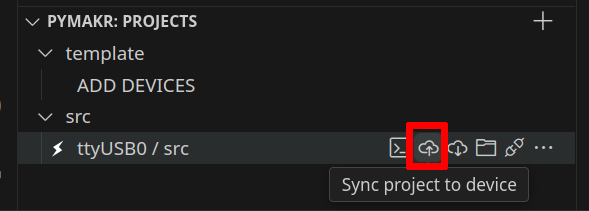
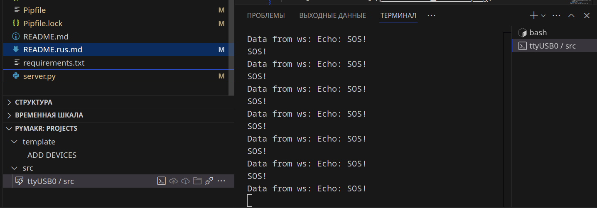
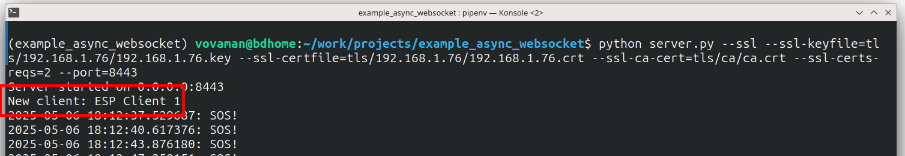

[Eng](README.md)
# example_async_websocket
Этот проект создан для тестирования работы пакета
[micropython-async-websocket-client](https://pypi.org/project/micropython-async-websocket-client/).

В проекте рассматривается работа контроллера
[ESP32S controller](https://ru.wikipedia.org/wiki/%D0%A4%D0%B0%D0%B9%D0%BB:ESP32_Espressif_ESP-WROOM-32_Dev_Board.jpg)
и клонов под управлением [micropython](https://micropython.org).

Задачи, решаемые пакетом `micropython-async-websocket-client`:
1. Создать и поддерживать в рабочем режиме websocket-канал для связи с сервером.
2. Разрыв связи с сервером не должен влиять на основной рабочий цикл контроллера.
3. Данные не только посылаются на сервер, но появляется также возможность принимать управляющие сигналы с сервера.

# Требования
- ESP32 контроллер
- USB кабель с проводом для передачи данных
- Ubuntu 24.04
- Python 3.10
- VSCode + PyMakr plugin

> [!CAUTION]
> 1. Используйте только  deb-установку VSCode!
>    В версии для `snap` не работает расширение `PyMakr`!
> 2. Проект https://github.com/Vovaman/start_ESP32_with_micropython объясняет,
>    как работать с ESP32 из VSCode.
>
>    Установка плагина PyMakr, копирование файлов на контроллер,
>    синхронизация проекта и т.д. - все операции описаны в указанном проекте.
> 3. Все дальнейшие действия предполагают, что установлены ``pipenv`` и ``pyenv``,
>    как описано в проекте https://github.com/Vovaman/start_ESP32_with_micropython.
>
>    Все действия выполняются в корневой папке проекта, внутри виртуальной среды ``pipenv``.

- сеть WiFi

> [!CAUTION]
> Исходим из того, что работаем с ESP32 в локальной wi-fi сети.
>
> Примеры с TLS используют самоподписанные сертификаты.

# Запуск примеров
Перед выполнением всех описанных ниже примеров:
- Выясним имя (``<wifi network name>``) и пароль ``<wifi network pwd>`` wifi-сети,
  посредством которой связаны компьютер, на котором мы работаем и контроллер;
- Определим IP-адрес компьютера (``<host IP>``), на котором мы работаем, в указанной wifi-сети.
- Выполним синхронизацию проекта с контроллером;
  
- [установим](https://github.com/Vovaman/micropython_async_websocket_client?tab=readme-ov-file#installation) пакет ``async_websocket_client``

В случае успешного установления связи между сервером и контроллером вывод в терминале контроллера будет иметь вид:



...вывод сервера в консоли:


## WS. Безопасность отсутствует.
Самый простой случай: канал связи не шифруется.

1. ``src/config.json``:
   ```json
   {
      "wifi": {
         "SSID": "<wifi network name>",
         "password": "<wifi network pwd>",
         "attempts": 3,
         "delay_in_msec": 200
      },
      "server": "ws://<host IP>:8000/",
      "socket_delay_ms": 5
   }
   ```
2. Обновляем проект на контроллере:
   ```bash
   $ mpremote fs cp src/* :/
   ```
3. Перезапускаем контроллер.
4. Запуск сервера:
   ```bash
   $ python server.py
   ```
## WSS
### Сертификаты не проверяются ни клиентом, ни сервером
> [!CAUTION]
> TLS предполагает, что канал связи шифруется в любом случае, даже без сертификатов,
> но, тем не менее, это небезопасный способ связи!

1. ``src/config.json``:
   ```json
   {
      "wifi": {
         "SSID": "<wifi network name>",
         "password": "<wifi network pwd>",
         "attempts": 3,
         "delay_in_msec": 200
      },
      "server": "wss://<host IP>:8443/",
      "ssl":{
         "cert_reqs": 0
      }
      "socket_delay_ms": 5
   }
   ```

2. Не смотря на то, что проверка сертификатов не требуется,
   сервер всё равно должен запускаться с серверными сертификатом и ключом.

   Генерируем сертификаты:
   ```bash
   $ ./gen_crt.sh --srv=<host IP>
   ```

> [!NOTE]
> Скрипт ``gen_crt.sh`` запрашивает пароль для ключа.
> В процессе выполнения этого скрипта вводите один и тот же пароль.

   Скрипт автоматически копирует нужные файлы в каталог, предназначенный для синхронизации с контроллером, но в этом примере контроллеру не нужны никакие сертификаты, поэтому удаляем ненужные файлы:
   ```bash
   $ rm src/*.crt src/*.key src/ca.der
   ```
3. Обновляем проект на контроллере:
   ```bash
   $ mpremote fs cp src/* :/
   ```
4. Перезапускаем контроллер.
5. Запускаем сервер:
   ```bash
   $ python server.py --ssl --ssl-keyfile=tls/<host IP>/<host IP>.key --ssl-certfile=tls/<host IP>/<host IP>.crt --port=8443
   ```

> [!CAUTION]
> Обратите внимание, что в таком режиме работы серверу не требуется сертификат центра авторизации.

### Сертификат сервера проверяется контроллером, сервер не требует наличия сертификата у клиента
> [!CAUTION]
> Это более высокий уровень безопасности: контроллер проверяет корректность сертификата сервера,
> но сервер допускает соединение с любым клиентом.
>
> Это также небезопасный способ связи.

1. ``src/config.json``:
   ```json
   {
      "wifi": {
         "SSID": "<wifi network name>",
         "password": "<wifi network pwd>",
         "attempts": 3,
         "delay_in_msec": 200
      },
      "server": "wss://<host IP>:8443/",
      "ssl":{
         "cert_reqs": 2,
         "ca": "ca.der"
      }
      "socket_delay_ms": 5
   }
   ```

2. Генерируем сертификаты:
   ```bash
   $ ./gen_crt.sh --srv=<host IP>
   ```

> [!NOTE]
> Скрипт ``gen_crt.sh`` запрашивает пароль для ключа.
> В процессе выполнения этого скрипта вводите один и тот же пароль.

   Скрипт автоматически копирует нужные файлы в каталог, предназначенный для синхронизации с контроллером, но в этом примере контроллеру нужен только сертификат центра сертификации, поэтому удаляем ненужные файлы:
   ```bash
   $ rm src/*.crt src/*.key
   ```
3. Сертификат действителен в течение определённого периода времени, начиная с момента выдачи.

   Контроллер не имеет энергонезависимых часов и установленное на нём по умолчанию время - начало суток 1 января 2000 года.

   Если не установить правильную дату, то при проверке сертификата сервера контроллер будет выдавать ошибку:
   ``The certificate validity starts in the future``.

   Установим дату и время на контроллере, выполнив в его консоли команды:

   ```python
   >>> from machine import RTC
   >>> rtc = RTC()
   >>> rtc.datetime((2025,5,7,1,13,0,0,0)) # впишите корректные числа, соответствующие текущей метке времени
   ```
4. Обновляем проект на контроллере:
   ```bash
   $ mpremote fs cp src/* :/
   ```
5. Перезапускаем контроллер.
> [!CAUTION]
> При перезапуске контроллера время может сброситься к первоначальному значению.
> Если с вашим контроллером такое происходит регулярно, то команды установления метки времени необходимо вписать
> в код проекта.
6. Запускаем сервер:
   ```bash
   $ python server.py --ssl --ssl-keyfile=tls/<host IP>/<host IP>.key --ssl-certfile=tls/<host IP>/<host IP>.crt --port=8443
   ```
### Опциональная проверка сертификатов
Режим опциональной проверки сертификатов сервера реализован и в модуле ``async_websocket_client``, и на тестовом сервере, но рассматривать его мы не будем.

### Проверка сертификатов сервером и контроллером
Самый безопасный режим работы.

Позволяет реализовать аутентификацию и авторизацию клиента на базе данных из сертификата.
1. Генерируем сертификаты. Кроме IP сервера укажем имя клиента:
   ```bash
   $ ./gen_crt.sh --srv=<host IP> --cn="ESP Client 1"
   ```
> [!NOTE]
> Скрипт ``gen_crt.sh`` запрашивает пароль для ключа.
> В процессе выполнения этого скрипта вводите один и тот же пароль.

   Скрипт скопирует все нужные файлы в каталог для проекта на контроллере.

2. ``src/config.json``:
   ```json
   {
      "wifi": {
         "SSID": "<wifi network name>",
         "password": "<wifi network pwd>",
         "attempts": 3,
         "delay_in_msec": 200
      },
      "server": "wss://<host IP>:8443/",
      "ssl": {
        "key": "ESP Client 1.key",
        "cert": "ESP Client 1.crt",
        "ca": "ca.der",
        "cert_reqs": 2
    },
      "socket_delay_ms": 5
   }
   ```
3. Аналогично предыдущему примеру, устанавливаем на контроллере корректное время.
4. Обновляем проект на контроллере:
   ```bash
   $ mpremote fs cp src/* :/
   ```
5. Перезапускаем контроллер.
6. Запускаем сервер:
   ```bash
   $ python server.py --ssl --ssl-keyfile=tls/<host IP>/<host IP>.key --ssl-certfile=tls/<host IP>/<host IP>.crt --ssl-ca-cert=tls/ca/ca.crt --ssl-certs-reqs=2 --port=8443

Сервер получает имя клиента из сертификата:



Таким образом, на сервере можно организовать авторизацию пользователей с помощью сертификатов.

# Компоненты тестового проекта
## Тестовый сервер
Тестовый websocket-сервер реализован в файле `server.py`.
Сервер поддерживает подключение по websocket, получает от клиентов сообщения и посылает их обратно.
## Проект для ESP32
Папка `src` содержит файлы для тестового ESP32 проекта.
Функциональность проекта состоит из двух задач:
- основной рабочий цикл контроллера моргает голубым диодом (при его наличии на контроллере) и посылает на сервер сообщение `SOS!`;
- цикл чтения данных получает данные с сервера.

# Создание окружения проекта
Все описываемые шаги будут выполняться внутри VSCode.
> :warning: Как работать с контроллером в VSCode
> см. https://github.com/Vovaman/start_ESP32_with_micropython.
> Прочитайте описание в этом проекте перед тем, как продолжать.

Откройте терминал (в VSCode или обычный) и внутри папки с исходниками
этого проекта выполните команду:
```bash
$ pipenv install
```
Эта команда создаст python-окружение для проекта и установит все необходимые пакеты (см. их список в файле `Pipfile`).

# Прошивка контроллера
Прошейте контроллер файлом с micropython'ом. Для чего либо скачайте прошивку с сайта http://micropython.org.

> [!NOTE]
> Проект тестировался [на прошивке версии 1.25.0](https://micropython.org/resources/firmware/ESP32_GENERIC-20250415-v1.25.0.bin).

# Параметры
## src/config
```
{
    "wifi": {
        "SSID": "SSID",                      # имя сети
        "password": "***********",           # пароль для подключения к сети
        "attempts": 3,                       # количество попыток подключения к сети в течение одного цикла работы
        "delay_in_msec": 200                 # задержка после команды `wifi.connect()`
    },
    "server": "ws://192.168.1.100:8000/",    # адрес подключения к тестовому серверу
    "socket_delay_ms": 5                     # задержка для операций чтения/записи данных тестового сервера.
                                             # если у вас медленная сеть,
                                             # попробуйте увеличить эту задержку
}
```

# Заключение
Все компоненты работают. ESP32 выполняет свою работу и поддерживает канал связи с сервером, сервер принимает сообщения и рассылает их всем клиентам.

Попробуйте потестировать работу компонентов:
- включайте/выключайте контроллер,
- останавливайте сервер,
- быстро посылайте много сообщений из контроллера,
- меняйте параметры задержек в файле конфигурации `src/config.json,
- ...
