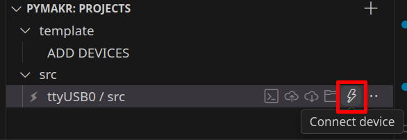
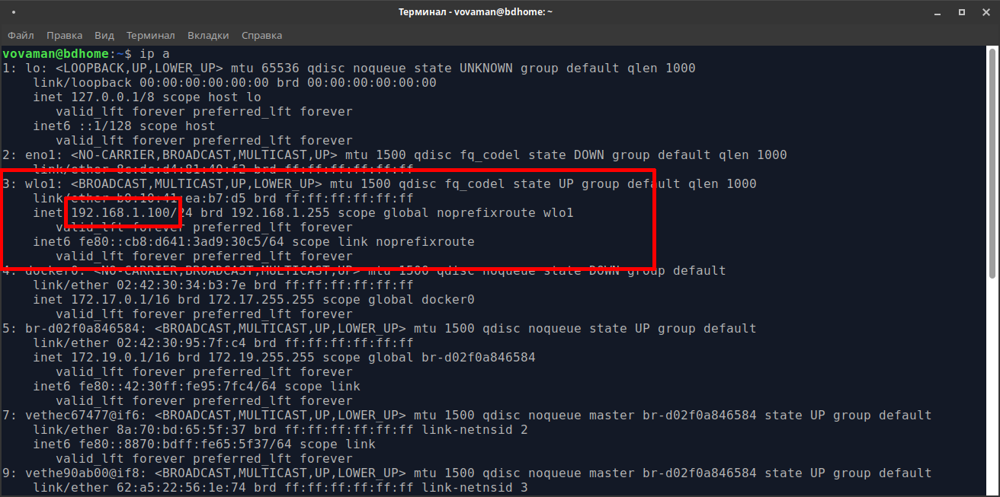

[Eng](README.md)
# example_async_websocket
Этот проект создан для тестирования работы пакета
[micropython-async-websocket-client](https://pypi.org/project/micropython-async-websocket-client/).
В проекте рассматривается работа контроллера
[ESP32S controller](https://ru.wikipedia.org/wiki/%D0%A4%D0%B0%D0%B9%D0%BB:ESP32_Espressif_ESP-WROOM-32_Dev_Board.jpg)
и клонов под управлением [micropython](https://micropython.org).

Задачи, решаемые пакетом `micropython-async-websocket-client`:
1. Создать и поддерживать в рабочем режиме websocket-канал для связи с сервером.
2. Разрыв связи с сервером не должен влиять на основной рабочий цикл контроллера.
3. Данные не только посылаются на сервер, но появляется также возможность принимать управляющие сигналы с сервера.

# Требования
- ESP32 контроллер
- USB кабель с проводом для передачи данных
- Ubuntu 24.04
- Python 3.10
- VSCode + PyMakr plugin

> [!CAUTION]
> Используйте только  deb-установку VSCode!
> В версии для `snap` не работает расширение `PyMakr`!

> [!NOTE]
> Проект https://github.com/Vovaman/start_ESP32_with_micropython объясняет,
> как работать с ESP32 из VSCode.
> Установка плагина PyMakr, копирование файлов на контроллер, синхронизация проекта и т.д. - все операции описаны в указанном проекте.

> [!NOTE]
> Все дальнейшие действия предполагают:
> 1. Установлены ``pipenv`` и ``pyenv``, как описано в проекте https://github.com/Vovaman/start_ESP32_with_micropython;
> 2. Все действия выполняются в корневой папке проекта, внутри виртуальной среды ``pipenv``.

     Для установки виртуальной среды выполните команду внутри папки проекта:
     ```bash
     $ pipenv install
     ```

     Вход в виртуальную среду - команда
     ```bash
     $ pipenv shell
     ```

- сеть WiFi

> [!NOTE]
> При работе с этим проектом исходим из того, что работаем с ESP32 в локальной wi-fi сети.
> Примеры с TLS используют самоподписанные сертификаты.

# Запуск примеров
Перед выполнением всех описанных ниже примеров:
- Выясним имя (``<wifi network name>``) и пароль ``<wifi network pwd>`` wifi-сети,
  посредством которой связаны компьютер, на котором мы работаем и контроллер;
- Определим IP-адрес компьютера (``<host IP>``), на котором мы работаем, в указанной wifi-сети.
- Выполним синхронизацию проекта с контроллером;
  
- [установим](https://github.com/Vovaman/micropython_async_websocket_client?tab=readme-ov-file#installation) пакет ``async_websocket_client``

Первый шаг во всех примерах ниже - исправление файла конфигурации и копирование его на контроллер.

Для этого:
1. Находясь в консоли контроллера, прерываем выполнение проекта, для чего нажимаем ``Ctrl+C``.
2. Разрываем связь с контроллером:
   
3. Выполняем в консоли проекта (не в терминале контроллера!) команду копирования конфигурации на контроллер:

   ```bash
   $ mpremote fs cp src/config.json :/
   ```
4. Устанавливаем связь с контроллером:
   
5. ...и перезапускаем его:
   

В случае, если примером предполагается копирование на контроллер файлов сертификатов, то на третьем шаге копируем не только файл конфигурации, но и файлы сертификатов, указанные в примере.

В случае успешного установления связи между сервером и контроллером вывод в терминале контроллера будет иметь вид:


...вывод сервера в консоли:


## WS. Безопасность отсутствует.
Самый простой случай: канал связи не шифруется.

1. ``src/config.json``:
   ```json
   {
      "wifi": {
         "SSID": "<wifi network name>",
         "password": "<wifi network pwd>",
         "attempts": 3,
         "delay_in_msec": 200
      },
      "server": "ws://<host IP>:8000/",
      "socket_delay_ms": 5
   }
   ```
2. Запуск сервера:
   ```bash
   $ python server.py
   ```
## WSS
### Сертификаты не проверяются ни клиентом, ни сервером
> [!CAUTION]
> TLS предполагает, что канал связи шифруется в любом случае, даже без сертификатов,
> но, тем не менее, это небезопасный способ связи!

1. ``src/config.json``:
   ```json
   {
      "wifi": {
         "SSID": "<wifi network name>",
         "password": "<wifi network pwd>",
         "attempts": 3,
         "delay_in_msec": 200
      },
      "server": "wss://<host IP>:8443/",
      "ssl":{
         "cert_reqs": 0
      }
      "socket_delay_ms": 5
   }
   ```

2. Не смотря на то, что проверка сертификатов не требуется,
   сервер всё равно должен запускаться с серверными сертификатом и ключом.

   Генерируем сертификаты:
   ```bash
   $ ./gen_crt.sh --srv=<host IP>
   ```
   > [!NOTE]
   > Скрипт ``gen_crt.sh`` запрашивает пароль для ключа.
   > В процессе выполнения этого скрипта вводите один и тот же пароль.

   Скрипт автоматически копирует нужные файлы в каталог, предназначенный для синхронизации с контроллером, но в этом примере контроллеру не нужны никакие сертификаты, поэтому удаляем ненужные файлы:
   ```bash
   $ rm src/*.crt src/*.key src/ca.der
   ```
3. Запускаем сервер:
   ```bash
   $ python server.py --ssl --ssl-keyfile=tls/<host IP>/<host IP>.key --ssl-certfile=tls/<host IP>/<host IP>.crt --port=8443
   ```
   > [!CAUTION]
   > Обратите внимание, что в таком режиме работы серверу не требуется сертификат центра авторизации.

### Сертификат сервера проверяется контроллером, сервер не требует наличия сертификата у клиента
> [!CAUTION]
> Это более высокий уровень безопасности: контроллер проверяет корректность сертификата сервера,
> но сервер допускает соединение с любым клиентом.
>
> Это также небезопасный способ связи.

1. ``src/config.json``:
   ```json
   {
      "wifi": {
         "SSID": "<wifi network name>",
         "password": "<wifi network pwd>",
         "attempts": 3,
         "delay_in_msec": 200
      },
      "server": "wss://<host IP>:8443/",
      "ssl":{
         "cert_reqs": 2
      }
      "socket_delay_ms": 5
   }
   ```

2. Генерируем сертификаты:
   ```bash
   $ ./gen_crt.sh --srv=<host IP>
   ```
   > [!NOTE]
   > Скрипт ``gen_crt.sh`` запрашивает пароль для ключа.
   > В процессе выполнения этого скрипта вводите один и тот же пароль.

   Скрипт автоматически копирует нужные файлы в каталог, предназначенный для синхронизации с контроллером, но в этом примере контроллеру нужен только сертификат центра сертификации, поэтому удаляем ненужные файлы:
   ```bash
   $ rm src/*.crt src/*.key
   ```
3. Запускаем сервер:
   ```bash
   $ python server.py --ssl --ssl-keyfile=tls/<host IP>/<host IP>.key --ssl-certfile=tls/<host IP>/<host IP>.crt --port=8443
   ```
### Опциональная проверка сертификатов
Режим опциональной проверки сертификатов сервера реализован и в модуле ``async_websocket_client``, и на тестовом сервере, но рассматривать его мы не будем.

### Проверка сертификатов сервером и контроллером
Самый безопасный режим работы. Позволяет реализовать аутентификацию и авторизацию клиента на базе данных из сертификата.
1. Генерируем сертификаты. Кроме IP сервера укажем имя клиента:
   ```bash
   $ ./gen_crt.sh --srv=<host IP> --cn="ESP Client 1"
   ```
   > [!NOTE]
   > Скрипт ``gen_crt.sh`` запрашивает пароль для ключа.
   > В процессе выполнения этого скрипта вводите один и тот же пароль.

   Скрипт скопирует все нужные файлы в каталог для проекта на контроллере.

2. ``src/config.json``:
   ```json
   {
      "wifi": {
         "SSID": "<wifi network name>",
         "password": "<wifi network pwd>",
         "attempts": 3,
         "delay_in_msec": 200
      },
      "server": "wss://<host IP>:8443/",
      "ssl": {
        "key": "ESP Client 1.key",
        "cert": "ESP Client 1.crt",
        "ca": "ca.der",
        "cert_reqs": 2
    },
      "socket_delay_ms": 5
   }
   ```
3. Запускаем сервер:
   ```bash
   $ python server.py --ssl --ssl-keyfile=tls/<host IP>/<host IP>.key --ssl-certfile=tls/<host IP>/<host IP>.crt --ssl-ca-cert=tls/ca/ca.crt --ssl-certs-reqs=2 --port=8443

Сервер получает имя клиента из сертификата:


Таким образом, на сервере можно организовать авторизацию пользователей с помощью сертификатов.

# Компоненты тестового проекта
## Тестовый сервер
Тестовый websocket-сервер реализован в файле `server.py`.
Сервер создан с помощью фреймворка [FastAPI](https://fastapi.tiangolo.com/) и
имеет простую функциональность. Сервер поддерживает только одну команду
для клиентов: `ws(s)://<server>/<client_id>`, где
`client_id` - идентификатор клиента, случайное целое число.
Если клиент с `client_id` уже подсоединился, то новый запрос
на коннект будет отвергнут.
В противном случае будет создан новый websocket-канал с клиентом `client_id`.
Когда клиент посылает сообщение серверу, то сервер рассылает это сообщение
всем остальным клиентам.
## Проект для ESP32
Папка `src` содержит 2 файла для тестового ESP32 проекта.
Функциональность проекта состоит из двух задач:
- основной рабочий цикл контроллера моргает голубым диодом и посылает на сервер сообщение `SOS`;
- цикл чтения данных получает данные с сервера.

# Создание окружения проекта
Все описываемые шаги будут выполняться внутри VSCode.
> :warning: Как работать с контроллером в VSCode
> см. https://github.com/Vovaman/start_ESP32_with_micropython.
> Прочитайте описание в этом проекте перед тем, как продолжать.

Откройте терминал (в VSCode или обычный) и внутри папки с исходниками
этого проекта выполните команду:
```bash
$ pipenv install
```
Эта команда создаст python-окружение для проекта и установит все необходимые пакеты (см. их список в файле `Pipfile`).

# Прошивка контроллера
Прошейте контроллер файлом с micropython'ом. Для чего либо скачайте прошивку с сайта http://micropython.org, либо возьмите для этого файл `esp32-20220618-v1.19.1.bin` в этом проекте.

# Запуск проекта. Открытый протокол WS
## Исправление файлов конфигурации
1. Определите IP адрес вашего компьютера в wifi-сети, для чего в терминале выполните команду:
   ```bash
   $ ip a
   ```
   Команда выведет список всех сетевых драйверов с их параметрами.
   Найдите в этом списке wifi драйвер и IP адрес в его конфигурации:
   
2. Откройте файл `src/config.json` и исправьте параметры wifi-сети и параметр `server`, в который впишите определённый на предыдущем шаге IP адрес. Сохраните файл.
## Загрузка проекта в ESP32
С помощью `Pymakr` загрузите проект на ваш контроллер.
> :warning: Так как при заливке проекта на контроллер Pymakr обновляет всю
> файловую систему контроллера, то устанавливать
> `micropython-async-websocket-client` будем после заливки проекта.
## Установка пакета micropython-async-websocket-client
Установите на контроллер пакет `micropython-async-websocket-client`,
как описано в https://pypi.org/project/micropython-async-websocket-client/.

После установки пакета перезапустите контроллер,
он начнёт моргать голубым диодом.
## Запуск тестового websocket сервера
Откройте новый терминал в VSCode, войдите в окружение проекта,
если VSCode не сделал это автоматически и запустите сервер:
```bash
$ uvicorn server:app --reload --workers 1 --host 0.0.0.0 --port 8000 --ws-ping-interval 10 --ws-ping-timeout 10 --log-level info
```
> :warning: Обратите внимание, что сервер будет работать на 8000 порту!
> Этот порт вписан в файле `src/config.json`, в параметр `server`.

Итак, после старта сервера контроллер немедленно к нему соединится, используя случайное число в качестве номера клиента:


# Запуск проекта. Безопасный протокол WSS
> :warning: В настоящий момент не реализована функциональность по проверке
> сертификатов. Соответственно, безопасность реализована лишь частично.
> Для полной реализации безопасности ждём новых релизов Micropython'а.
## Исправление файлов конфигурации
1. Определите IP адрес вашего компьютера в wifi-сети, для чего в терминале выполните команду:
   ```bash
   $ ip a
   ```
   Команда выведет список всех сетевых драйверов с их параметрами.
   Найдите в этом списке wifi драйвер и IP адрес в его конфигурации:
   
2. Откройте файл `src/config.json` и исправьте параметры wifi-сети
   и параметр `server`, в который впишите определённый
   на предыдущем шаге IP адрес.
   При этом параметр `server` должен быть вида:
   `wss://<server_ip>:8443/`.
   Обратите внимание на изменение протокола с `ws` на `wss`,
   и на изменение номера порта.
   Не забудьте после номера порта поставить слэш!
   Сохраните файл.
## Загрузка проекта в ESP32
С помощью `Pymakr` загрузите проект на ваш контроллер.
> :warning: Так как при заливке проекта на контроллер Pymakr обновляет всю
> файловую систему контроллера, то устанавливать
> `micropython-async-websocket-client` будем после заливки проекта.
## Установка пакета micropython-async-websocket-client
Установите на контроллер пакет `micropython-async-websocket-client`,
как описано в https://pypi.org/project/micropython-async-websocket-client/.
После установки пакета перезапустите контроллер,
он начнёт моргать голубым диодом.
## Генерация сертификатов
Запустите на исполнение файл `gen_crt.sh`. Он создаст в корневой папке проекта
папку `tls` с сертификатами. Нам нужны будут только два файла: `server.key` и
`server.crt`.
## Запуск тестового websocket сервера
Откройте новый терминал в VSCode, войдите в окружение проекта,
если VSCode не сделал это автоматически и запустите сервер:
```bash
$ uvicorn server:app --reload --workers 1 --host 0.0.0.0 --port 8443 --ws-ping-interval 10 --ws-ping-timeout 10 --log-level info --ssl-keyfile=./tls/server.key --ssl-certfile=./tls/server.crt --ssl-ca-certs=ca-cert.pem
```
> :warning: Обратите внимание, что сервер будет работать на 8443 порту!
> Этот порт вписан в файле `src/config.json`, в параметр `server`.

Итак, после старта сервера контроллер немедленно к нему соединится, используя случайное число в качестве номера клиента:


# Postman
Добавим подключение ещё одного клиента к серверу, используя [Postman](https://www.postman.com/).
Установим его и запустим. Создадим новое websocket подключение используя команду `File --> New...`
и выбрав `WebSocket Request`.

> :warning: Не забудьте указать правильный протокол: `ws` или `wss`.


Введем адрес и нажмём кнопку `Connect`:


Вы увидите такой результат:


Теперь давайте пошлем какое-нибудь сообщение из Postman серверу. Для этого в области ввода текста наберем какую-нибудь строку и нажмём кнопку `Send`:


# Параметры
## src/config
```
{
    "wifi": {
        "SSID": "SSID",                      # имя сети
        "password": "***********",           # пароль для подключения к сети
        "attempts": 3,                       # количество попыток подключения к сети в течение одного цикла работы
        "delay_in_msec": 200                 # задержка после команды `wifi.connect()`
    },
    "server": "ws://192.168.1.100:8000/",    # адрес подключения к тестовому серверу
    "socket_delay_ms": 5                     # задержка для операций чтения/записи данных тестового сервера. если у вас медленная сеть,
                                             # попробуйте увеличить эту задержку
}
```
## Параметры uvicorn для сигналов pimg/pong
Pimg/pong - это обмен специальными сигналами между сервером и клиентом для поддержания в рабочем состоянии канала связи.
Параметры для pimg/pong определяются при запуске `uvicorn` в командной строке: `--ws-ping-interval 10 --ws-ping-timeout 10`.
Если вы уменьшите эти параметры, то задержка между физическим разрывом связи и закрытием канала уменьшится, но увеличится частота посылки сигналов
pimg/pong от сервера клиенту, что приведет к повышению нагрузки на контроллер.
Например, если выставить оба этих параметра в одну секунду, то контроллер, скорее всего, уже не будет успевать обрабатывать сигналы и канал связи будет
постоянно рваться.
> :warning: Обратите внимание, что при параметрах `--ws-ping-interval 10 --ws-ping-timeout 10`
> websocket канал будет закрываться примерно через 20 секунд после физического разрыва связи.

В любом случае, вы можете конфигурировать ваше рабочее окружение, подбирая нужные параметры для вашей модели контроллера и условий работы вашей wifi сети.

# Заключение
Все компоненты работают. ESP32 выполняет свою работу и поддерживает канал связи с сервером, сервер принимает сообщения и рассылает их всем клиентам.
1. Попробуйте потестировать работу компонентов:
   - включайте/выключайте контроллер,
   - останавливайте сервер,
   - быстро посылайте много сообщений из Postman'а,
   - меняйте параметры задержек в файле конфигурации `src/config.json,
   - меняйте параметры uvicorn `--ws-ping-interval 10 --ws-ping-timeout 10`
